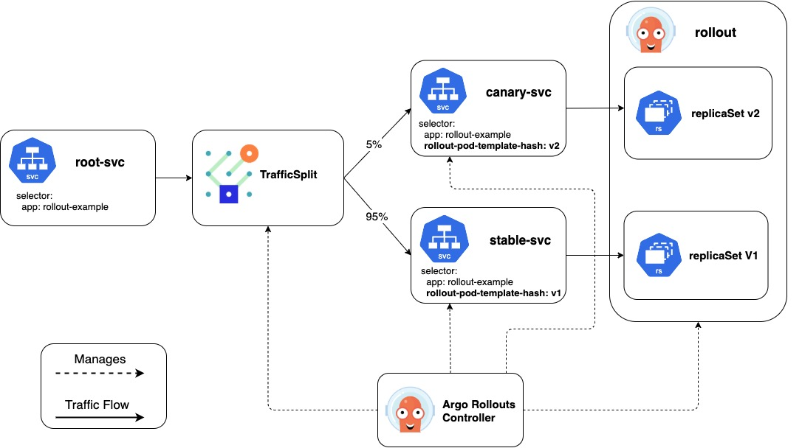

# Argo

[Good blog post](https://blog.argoproj.io/the-state-of-kubernetes-configuration-management-d8b06c1205) 
from Argo Team on CI/CD configuration management.

Argo project is made up of a number of solutions, I will review them here:
   * Argo Workflow (ArgoWF)
   * ArgoCD
   * Argo Rollout
   * Argo Events

## Argo Workflow (ArgoWF) is a workflow solution
[It is compared to other workflow solutions](https://www.youtube.com/watch?v=oXPgX7G_eow&utm_campaign=Singapore&utm_content=97139107&utm_medium=social&utm_source=twitter&hss_channel=tw-381629790)
I was intersted in it for the CI/CD use case but realized Lots of people look at for
data pipeline and ML use cases, which was an intersting use case I had not thought of for
Argo DAG. Here are some more options across those use cases, with native kubernetes solutions in the top:

   * [Brigade](https://brigade.sh/)
   * [Tekton](https://tekton.dev/)
   * [JenkinsX](https://jenkins-x.io/)
   * [Fision](https://fission.io) and [Fision Workflows](https://docs.fission.io/docs/workflows/)
   * [Airship](https://www.airshipit.org/) [Shipyard DAG](https://airshipit.readthedocs.io/projects/shipyard/en/latest/)
   * [Apache Airflow](https://airflow.apache.org/)
   * [Oozie](https://oozie.apache.org/docs/3.1.3-incubating/DG_Overview.html)
   * [Luigie](https://luigi.readthedocs.io/en/stable/workflows.html)
   * [AWS Data Pipeline](https://aws.amazon.com/datapipeline/)
   * [AWS Step Functions](https://aws.amazon.com/step-functions/)
   * [Spinnaker](https://www.spinnaker.io/)
   * [AWS Code Pipeline](https://aws.amazon.com/codepipeline/)
   * [Harness](https://harness.io/)
   * NiFi
   * Azkaban

This [blog is for CI/CD workflow](https://medium.com/axons/ci-cd-with-argo-on-kubernetes-28c1a99616a9)
Here we discuss [Jenkins](https://www.jenkins.io/) and [Spinnaker](https://www.spinnaker.io/)
This discussion of workflow seems heavy on the CI side with Docker in Docker to build containers
and Ansible to run tests, I am not sure I'm on board with that being the critical item in my
problems, probably why Argo CI is not heavily supported. It is a well written article in covering
the detail of ArgoWF. 

The federation pattern of a master and client clusters is one that I like in providing seperation of
concern, so 
[this article I liked](https://admiralty.io/blog/running-argo-workflows-across-multiple-kubernetes-clusters/)
and there is this article from 
[Crossplane on ArgoWF]()

In the open source there are three ways to do federation:
The [KubeFed](https://github.com/kubernetes-sigs/kubefed) is better suited for greenfield where you
are building something from ground up which requires clients to use new, federated APIs, 
e.g., federated deployment templates, placements, and overrides.

The Admiralty and Crossplane are better suited in using existing kubernetes resources and wrapping them
in the CRDs and annotations to proxy them to target clusters.  
 
At this time Admiralty and Crossplane have different goals, Admiralty is focused on primitives around
federating clusters at the pod level, and seamlessly scheduling workloads across multiple clusters.
Working with kubernetes Pod is a start and other low level elements like
[Horizontal Pod Autoscaler](https://kubernetes.io/docs/tasks/run-application/horizontal-pod-autoscale/) 
and service mesh like Istio or Linkerd and other workloads like Knative.

Crossplane is focused on Multi-Cloud and Application level deployment as their Workloads.
[The vision more grand in terms of what they want to accomplish](https://github.com/crossplane/crossplane/blob/master/design/design-doc-complex-workloads.md),
and the level of elements they want to orchestrate is more
coarse and not as aware of the underlying elements that are federated to remote cluster controllers. 
[This is a good description of that pattern](https://github.com/crossplane/crossplane/blob/master/design/design-doc-complex-workloads.md#federation-style-envelope-resources).

## ArgoWF Execution
At the top level you have the steps and you could also have a higher level 
[Directed Acyclic Graph (DAG)](https://en.wikipedia.org/wiki/Directed_acyclic_graph). DAG would
encapsulate the steps and allow execution to follow the desired graph.

The execution of the steps are done using a container Pod. In additional you can run
additional items along with the steps either with
[Daemon Containers](https://github.com/argoproj/argo/blob/master/examples/README.md#daemon-containers) 
that run for full workflow lifecycle or
[Sidecar Continaers](https://github.com/argoproj/argo/blob/master/examples/README.md#sidecars) 
for just the step in the same Pod as the step container. A special use of the sidecar pattern is the 
[Docker In Docker Sidecar](https://github.com/argoproj/argo/blob/master/examples/README.md#docker-in-docker-using-sidecars)
you can use for CI to build a contianer image and upload to registry.

## ArgoWF Review

The [ArgoWF Conditionals](https://github.com/argoproj/argo/tree/master/examples#conditionals) is
interesting aspect, the YAML for DAG and steps are fairly straightforward. 
Here are some examples...
***When*** conditionals:
```bash
        when: "{{steps.flip-coin.outputs.result}} == heads"
```
`when` conditional:
```yaml
        when: "{{steps.flip-coin.outputs.result}} == heads"
```

`retryStrategy` conditional that will dictate how failed or errored steps are retried:
```yaml
    retryStrategy:
      limit: 10
      retryPolicy: "Always"
      backoff:
        duration: "1"      # Must be a string. Default unit is seconds. Could also be a Duration, e.g.: "2m", "6h", "1d"
        factor: 2
        maxDuration: "1m"  # Must be a string. Default unit is seconds. Could also be a Duration, e.g.: "2m", "6h", "1d"
```
`exit-handler` invoked at the end of workflow:
```yaml
onExit: exit-handler                  # invoke exit-hander template at end of the workflow
  templates:
  # primary workflow template
  - name: intentional-fail
    container:
      image: alpine:latest
      command: [sh, -c]
      args: ["echo intentional failure; exit 1"]

  # Exit handler templates
  # After the completion of the entrypoint template, the status of the
  # workflow is made available in the global variable {{workflow.status}}.
  # {{workflow.status}} will be one of: Succeeded, Failed, Error
  - name: exit-handler
    steps:
    - - name: notify
        template: send-email
```
`activeDeadlineSeconds` to limit the elapsed time for a workflow:
```yaml
  templates:
  - name: sleep
    container:
      image: alpine:latest
      command: [sh, -c]
      args: ["echo sleeping for 1m; sleep 60; echo done"]
    activeDeadlineSeconds: 10           # terminate container template after 10 seconds
```
Workflows can be suspended by
```bash
argo suspend WORKFLOW
```
Or by specifying a `suspend` step on the workflow:
```yaml
apiVersion: argoproj.io/v1alpha1
kind: Workflow
metadata:
  generateName: suspend-template-
spec:
  entrypoint: suspend
  templates:
  - name: suspend
    steps:
    - - name: build
        template: whalesay
    - - name: approve
        template: approve
    - - name: delay
        template: delay
    - - name: release
        template: whalesay

  - name: approve
    suspend: {}

  - name: delay
    suspend:
      duration: 20    # Default unit is seconds. Could also be a Duration, e.g.: "2m", "6h", "1d"

  - name: whalesay
    container:
      image: docker/whalesay
      command: [cowsay]
      args: ["hello world"]
```
Once suspended, a Workflow will not schedule any new steps until it is resumed. 
It can be resumed manually by
```bash
argo resume WORKFLOW
```
Or automatically with a `duration` limit as the example above.

## ArgoWF UI
It is primitive but does a good job showing you a view of what the ArgoWF controller sees, it is
not designed to be multi-tenant, so it lacks security in knowing who is logging in and what they
can see and do on ArgoWF. The ArgoWF UI is not on LoadBalancer so it is not directly exposed outside.

## ArgoCD
Good overview of the overall solutions in the
[CI/CD including ArgoCD](https://www.inovex.de/blog/spinnaker-vs-argo-cd-vs-tekton-vs-jenkins-x/). 
This is a [good tutorial on ArgoCD](https://www.youtube.com/watch?v=r50tRQjisxw)
from last KubeCon, which uses following
[Github repo for handon lab](https://github.com/gitops-workshop/my-app-deployment). I moved
the content here so that it would be easier to reference so now it
under `github.com/seizadi/argo/argocd/lab`
```bash
cd argocd/lab
kustomize build base
```
For the handson lab they used Digital Ocean we will do it on Minikube,
```bash
minikube start
```
[see ArgoCD installation instructions](https://argoproj.github.io/argo-cd/getting_started/):
```bash
kubectl create namespace argocd
kubectl apply -n argocd -f https://raw.githubusercontent.com/argoproj/argo-cd/stable/manifests/install.yaml
kubectl create rolebinding default-admin --clusterrole=admin --serviceaccount=default:default
```
Install ArgoCD CLI, I'm using MacOS:
```bash
brew tap argoproj/tap
brew install argoproj/tap/argocd
```
Access The Argo CD API Server, by default, the Argo CD API server is not exposed with an external IP. 
To access the API server, so we change the argocd-server service type to LoadBalancer:
```bash
kubectl patch svc argocd-server -n argocd -p '{"spec": {"type": "LoadBalancer"}}'
```
You can follow the detail of the setup in the
[hands on lab README](argodcd/lab/README.md). The lab deployment base and overlay
is already setup so you can follow the ArgoCD setup, first find the ArgoCD service:
```bash
❯ minikube service list
|-------------|-----------------------|--------------|----------------------------|
|  NAMESPACE  |         NAME          | TARGET PORT  |            URL             |
|-------------|-----------------------|--------------|----------------------------|
..
| argocd      | -server argocd        | http/80      | http://192.168.64.26:30684 |
|             |                       | https/443    | http://192.168.64.26:30138 |
...
|-------------|-----------------------|--------------|----------------------------|
```

* Open http://192.168.64.26:30684

The default password is set to the name of the server pod.
```bash
❯ kubectl -n argocd get pods
NAME                                             READY   STATUS    RESTARTS   AGE
..
argocd-server-86cf69886-js4f7                    1/1     Running   0          96m

```

* Click "Login Via Github"
* Click "New application"

| Field | Value |
|-------|-------|
| Application name: | `seizadi-my-app` |
| Project: | `default` |
| Sync policy: | `Manual` |
| Repository: | `https://github.com/seizadi/argo` |
| Revision: | `HEAD` |
| Path: | `examples/argocd/lab/overlays/dev` |
| Cluster: | `https://kubernetes.default.svc` |
| Namespace: | `default` |

The UI is smart enough to fill in some fields.

* Click "Sync".
* Click "Synchronize" in the Sliding panel.

Now you should have a green application and pod running.

We did all this from the UI, but we can see how this would work if we did it
all from kubectl, there is also ArgoCD CLI that is layer above kubectl:

```bash
❯ k get crds
NAME                       CREATED AT
applications.argoproj.io   2020-06-24T22:57:23Z
appprojects.argoproj.io    2020-06-24T22:57:23Z
```
ArgoCD is fairly like weight it only has two CRDs that map to the top level
Project and the Application we create from UI.
```bash
> k describe crd applications.argoproj.io 
....
    Short Names:
      app
      apps
    Singular:  application
...
```
```bash
> k describe crd appprojects.argoproj.io
  Accepted Names:
    Kind:       AppProject
    List Kind:  AppProjectList
    Plural:     appprojects
    Short Names:
      appproj
      appprojs
    Singular:  appproject
```
```bash
❯ k -n argocd get appprojects
NAME      AGE
default   167m
❯ k -n argocd describe  appproject default
Name:         default
Namespace:    argocd
Labels:       <none>
Annotations:  <none>
API Version:  argoproj.io/v1alpha1
Kind:         AppProject
Metadata:
  Creation Timestamp:  2020-06-24T22:58:06Z
  Generation:          1
  Managed Fields:
    API Version:  argoproj.io/v1alpha1
    Fields Type:  FieldsV1
    fieldsV1:
      f:spec:
        .:
        f:clusterResourceWhitelist:
        f:destinations:
        f:sourceRepos:
    Manager:         argocd-server
    Operation:       Update
    Time:            2020-06-24T22:58:06Z
  Resource Version:  873
  Self Link:         /apis/argoproj.io/v1alpha1/namespaces/argocd/appprojects/default
  UID:               2dc12ce8-07da-4035-b100-65f455dc58a3
Spec:
  Cluster Resource Whitelist:
    Group:  *
    Kind:   *
  Destinations:
    Namespace:  *
    Server:     *
  Source Repos:
    *
Events:  <none>
```
So looks like the ArgoCD project `Spec` is mainly a filter to limit the
project to where and from what repos the Applications can be created.
```yaml
Spec:
  Cluster Resource Whitelist:
    Group:  *
    Kind:   *
  Destinations:
    Namespace:  *
    Server:     *
  Source Repos:
    *
```

```bash
❯ k -n argocd get apps
NAME             AGE
seizadi-my-app   30m
❯ k -n argocd get app seizadi-my-app
NAME             AGE
seizadi-my-app   31m
❯ k -n argocd describe app seizadi-my-app
Name:         seizadi-my-app
Namespace:    argocd
Labels:       <none>
Annotations:  <none>
API Version:  argoproj.io/v1alpha1
Kind:         Application
Metadata:
  Creation Timestamp:  2020-06-25T01:17:52Z
  Generation:          21
  Managed Fields:
    API Version:  argoproj.io/v1alpha1
...
    Manager:      argocd-server
    Operation:    Update
    Time:         2020-06-25T01:24:46Z
    API Version:  argoproj.io/v1alpha1
...
Spec:
  Destination:
    Namespace:  default
    Server:     https://kubernetes.default.svc
  Project:      default
  Source:
    Path:             argocd/lab/overlays/dev
    Repo URL:         https://github.com/seizadi/argo
    Target Revision:  HEAD
Status:
  Health:
    Status:  Healthy
  History:
    Deployed At:  2020-06-25T01:24:46Z
    Id:           0
    Revision:     89177d85261bca6d55cd418f4d52d8174ea25447
    Source:
      Path:             argocd/lab/overlays/dev
      Repo URL:         https://github.com/seizadi/argo
      Target Revision:  HEAD
  Observed At:          2020-06-25T01:48:56Z
  Operation State:
    Finished At:  2020-06-25T01:24:46Z
    Message:      successfully synced (all tasks run)
    Operation:
      Initiated By:
        Username:  admin
      Sync:
        Revision:  89177d85261bca6d55cd418f4d52d8174ea25447
        Sync Strategy:
          Hook:
    Phase:       Succeeded
    Started At:  2020-06-25T01:24:46Z
    Sync Result:
      Resources:
        Group:       
        Hook Phase:  Running
        Kind:        Pod
        Message:     pod/seizadi-my-app created
        Name:        seizadi-my-app
        Namespace:   default
        Status:      Synced
        Sync Phase:  Sync
        Version:     v1
      Revision:      89177d85261bca6d55cd418f4d52d8174ea25447
      Source:
        Path:             argocd/lab/overlays/dev
        Repo URL:         https://github.com/seizadi/argo
        Target Revision:  HEAD
  Reconciled At:          2020-06-25T01:48:56Z
  Resources:
    Health:
      Status:   Healthy
    Kind:       Pod
    Name:       seizadi-my-app
    Namespace:  default
    Status:     Synced
    Version:    v1
  Source Type:  Kustomize
  Summary:
    Images:
      gitopsworkshop/my-app:v1
  Sync:
    Compared To:
      Destination:
        Namespace:  default
        Server:     https://kubernetes.default.svc
      Source:
        Path:             argocd/lab/overlays/dev
        Repo URL:         https://github.com/seizadi/argo
        Target Revision:  HEAD
    Revision:             89177d85261bca6d55cd418f4d52d8174ea25447
    Status:               Synced
Events:
  Type    Reason              Age   From                           Message
  ----    ------              ----  ----                           -------
  Normal  ResourceCreated     31m   argocd-server                  admin created application
  Normal  ResourceUpdated     31m   argocd-application-controller  Updated sync status:  -> OutOfSync
  Normal  ResourceUpdated     31m   argocd-application-controller  Updated health status:  -> Missing
  Normal  OperationStarted    27m   argocd-server                  admin initiated sync to HEAD (89177d85261bca6d55cd418f4d52d8174ea25447)
  Normal  OperationCompleted  27m   argocd-application-controller  Sync operation to 89177d85261bca6d55cd418f4d52d8174ea25447 succeeded
  Normal  OperationStarted    24m   argocd-server                  admin initiated sync to HEAD (89177d85261bca6d55cd418f4d52d8174ea25447)
  Normal  ResourceUpdated     24m   argocd-application-controller  Updated sync status: OutOfSync -> Synced
  Normal  OperationCompleted  24m   argocd-application-controller  Sync operation to 89177d85261bca6d55cd418f4d52d8174ea25447 succeeded
  Normal  ResourceUpdated     24m   argocd-application-controller  Updated health status: Missing -> Progressing
  Normal  ResourceUpdated     24m   argocd-application-controller  Updated health status: Progressing -> Healthy
```

The ArgoCD Application `Spec` is very close to the UI presentation:
```yaml
Spec:
  Destination:
    Namespace:  default
    Server:     https://kubernetes.default.svc
  Project:      default
  Source:
    Path:             argocd/lab/overlays/dev
    Repo URL:         https://github.com/seizadi/argo
    Target Revision:  HEAD
```
The `Target Revision` can be the git-id, tag or version of the source repo.

To follow the lab we make a change and now on UI `hit Refresh` and you should it is out of
sync and should be able to see the difference and `hit Sync` which will cause the deployment
to fail. We can use the `hit rollback` to restore to V1 version then update the git repo
to v1 so both repo and ArgoCD are in sync.

### ArgoCD Secrets
ArgoCD and [Flux](https://www.weave.works/blog/storing-secure-sealed-secrets-using-gitops) as 
GitOps tools both have to solve the Secret problem, since you don't want to store them
in the repo and both propose to use [Sealed Secrets](https://github.com/bitnami-labs/sealed-secrets)
This is the [ArgoCD demo of it](https://github.com/gitops-workshop/secrets)

### ArgoCD Helm
ArgoCD can also act as a helm Operator using GitOps model. This
[helm hands on lab](https://github.com/gitops-workshop/helm) demonstrates how to
publish a helm repo from Git repo. You can see in this part of the
[helm hands on lab](https://github.com/gitops-workshop/argo-cd-demos) how the
helm app is deployed:
```bash
argocd app create helm-app --repo https://github.com/gitops-workshop/helm.git --path my-app --revision master --dest-server https://kubernetes.default.svc --dest-namespace my-app-helm
argocd app sync helm-app
```

## Compare ArgoCD versus Flux
I am putting this here for now, should be some where else so I can easily find and update

* Capability to automatically deploy/sync application when docker image is changed 

ArogCD: Doesn't by default. You'll need another step in the CI to modify the deployment 
files/helm values with the new image tag, so it will detect the change to Git and change deployment.

Flex: Monitors the Docker Image can have write access to Git repo and automatically change the
deployment to the new image and push new deployment.

* Handle multiple Git Repos:

ArgoCD: Can support multiple Git Repos and multiple clusters, but does not have a 
robust RBAC for multi-tenancy,
it makes it difficult to build a GitOps for the cluster resources and one for each team
on to manage their namespace(s) and application deployment.

Flex: Each instance of Flex handles a Git repo, can support multi-tenancy with multiple
instances. It can be tiered with one at cluster level and deploying other Flex instances
for application teams. It lacks single pane of glass visibility to see all applications
 and deployment across cluster(s).

* Support for Federation

ArgoCD: Can support multi-cluster configuration and they have documented a pattern
for Federation called 
[App of Apps](https://argoproj.github.io/argo-cd/operator-manual/cluster-bootstrapping/).
In which a parent cluster can spawn application on child clusters.

Flux: It does not support multi-cluster, but you could pair it with projects like Kube-Fed,
Admirality or Crossplane to solve these use cases.

## ArgoCD CI/CD GitOps Patterns
This is [Flux Issue](https://github.com/fluxcd/flux/issues/1071) has a good
review of what type of GitOps patterns people are using or enhancements they would
like to see in GitOps tool like ArgoCD or Flux.

This is a good summary of the above...
Branch-per-environment
👍 simpler filesystem structure: a single set of resources

👍 a cluster is modified by modifying its branch

👍 divergent branches (=> clusters/environments) can be detected via git diff and so potentially automatically brought back into sync

👎 PR process is complicated by having to choose the correct branch as the comparison base/merge target

👎 some changes will need to be merged to all branches

👎 divergent branches will cause merge conflicts

👎 Flux cannot be configured to watch multiple branches for a single cluster, ArgoCD can do this.

The first two of the 👎s can be addressed with automation (GitHub actions, command-line app, etc.). Divergent branches can't be resolved with automation, but might be prevented entirely by automation. The last 👎 can be resolved with a flux instance per environment

Directory-per-environment

👍 simpler branching structure: a single branch means no risk of merge conflicts

👍 a cluster is modified by modifying its directory

👍 PR process is simple: branch off master, merge back to master

👍 multi-cluster updates are simpler: side-by-side comparison of cluster state in the repo, copy-paste changes between files

👍 Flux and ArgoCD can be configured to watch multiple paths for a single cluster

👎 divergent environments may be harder to detect

👎 mental load of having everything in the same place is not insignificant

The first of the 👎s can be addressed with automation (PR checks, GitHub Actions, commit hooks, etc.)


The other other aspect is whether to based the design on ArgoCD or Flux. This
[GitOpsEngine Design](https://github.com/argoproj/gitops-engine/blob/master/specs/design.md)
and associated
[Bottom-Up Design](https://github.com/argoproj/gitops-engine/blob/master/specs/design-bottom-up.md)
and
[Top-Down Design](https://github.com/argoproj/gitops-engine/blob/master/specs/design-top-down.md)
give overview of the two solutions. I captured what I feel are the strenghts/weaknesses below:

ArgoCD:
👍 view of all applications and health in single dashboard

👍 multi-cluster view of all applications

👎 require [Auth/Groups](https://argoproj.github.io/argo-cd/operator-manual/user-management/okta/) 
and [RBAC](https://argoproj.github.io/argo-cd/operator-manual/rbac/)

👎 require more attention to [security](https://argoproj.github.io/argo-cd/operator-manual/security/).
admin user credentials should be not be used on the system and RBAC groups used for access instead.

Flux: 

👍 easy to setup and scale

👍 can give full control of namespace including Flux component to application developers

👍 ability to monitor docker images and write updates to git repo, in practice I think to
update the repo has a more complex workflow and updating the docker registry and git repo can all be
part of that workflow


👎 no global dashboard or view of all applications and health ( can be built using APIs)

👎 not multi-cluster ( can be built using Federation )

### Comparison of ArgoCD single versus multi-cluster
#### 1 argocd for N clusters:
pro: single dashboard
pro: single place to configure webhooks and your SSO / RBAC integration
pro: a single place for your CI/CD system to communicate with to watch app rollouts and health
con: all apps need unique names (so… all your CRDs need target-cluster specific prefixes/suffixes)
con: blast-radius
con: setting up 1 argo cd that has permission to effect change in all your clusters could make your security staff sad. (bribe them with baked goods).
con: you’ve got to do some (kinda) convoluted bootstrapping of the target clusters. 1. create cluster. 2. ensure master cluster can talk to k8s API of new cluster 3. setup the cluster secret in master, and roles in destination 4. create a bootstrapping app to create namespaces in the target cluster 5. create all the apps that actually deploy from the master to the target
#### 1 argocd per cluster
pro: all changes are ‘pull’ — it’s reaching out to git to decide what to do, no external argocd has to be given access to your cluster
pro: much easier naming of your apps
pro: blast radius
pro: bootstrapping a new cluster is easier. 1. create cluster 2. install argo manifests to new cluster 3. apply all the app CRDs that deploy to local cluster.
con: multiple dashboards / sso / webhooks (maybe that’s mitigated if they all feed into one monitoring system? depends on who’s using the dashboard and for what purpose)
con: if your CI/CD system talks to the argocd API to wait for rollouts, your CICD pipeline needs to know about all the argocd instances. (and auth credentials for each)
how you weigh those pros/cons are going to depend on you and your team, and what you find painful/complex.
it’d probably also depend on how often you add new clusters or replace clusters; and how you manage all the stuff ‘around’ your platform that glues things together.

## Argo Rollout
This is the soltuion that is similar to Flagger and unlike Flagger that works with existing
Deployment and new CRD to wrap it, Rollout requires application developers to make changes 
to their Deployment to a new CRD to take advantage of Rollout.

This is a good [overview from the Intuit Team](https://www.youtube.com/watch?v=yeVkTTO9nOA), 
it is quiet old and this is a 
[better overview](https://www.youtube.com/watch?v=fviYWA2mcF8)
of the Rollout. The Argo Rollout [concepts are here](https://argoproj.github.io/argo-rollouts/concepts/).

In general there is weak integration across the Argo projects,
here is a description of 
[how ArgoCD and Argo Rollout integrate](https://argoproj.github.io/argo-rollouts/FAQ/#how-does-argo-rollouts-integrate-with-argo-cd).

Now for PoC with Argo Rollout....

[Install Argo Rollout](https://argoproj.github.io/argo-rollouts/installation/).
I will focus on Argo Rollout with Linkerd, so look at
[Argo Rollout Traffic Management](https://argoproj.github.io/argo-rollouts/features/traffic-management/).
For linkerd we look at
[Traffic Split Interface](https://argoproj.github.io/argo-rollouts/features/traffic-management/smi/).

The reference diagram for SMI is similar to what we have for Flagger/Linkerd:


Add Argo Rollout plugin on MacOS for following PoC:
```bash
brew install argoproj/tap/kubectl-argo-rollouts
kubectl argo rollouts version
```
I did a 
[Flux and Linkerd PoC](https://github.com/seizadi/flagger-linkerd),
 I follow a similar PoC with Argo Rollout and compare the two solutions.

**** CAUTION THE STEPS BELOW WILL DELETE YOUR CURRENT MINIKUBE INSTALLATION ****

```bash
cd examples/argorollout
make rollout
make test
```
To check status:
```bash
make status
```

To change image:
```bash
make update-yellow
make status
make watch
```

## Argo Events
[Argo Events](https://github.com/argoproj/argo-events), is an event-driven workflow 
automation framework for Kubernetes which helps you trigger K8s objects, Argo Workflows, 
Serverless workloads, etc. on events from variety of sources like webhook, s3, schedules, 
messaging queues, gcp pubsub, sns, sqs, etc.

It will be interesting to contrast it to a package like [Atlas PubSub](https://github.com/infobloxopen/atlas-pubsub)
or a platform like [Dapr](https://dapr.io/).

Here is the highlevel architcture diagram and components:
* [Event Source](https://argoproj.github.io/argo-events/concepts/event_source/)
* [Gateway](https://argoproj.github.io/argo-events/concepts/gateway/)
* [Sensor](https://argoproj.github.io/argo-events/concepts/sensor/)
* [Trigger](https://argoproj.github.io/argo-events/concepts/trigger/)


I was trying to think how this would work as a general purpose notification engine.
It would be good to see how we can use AWS SNS to handle AWS SMS and SES use cases, and other 
gateways like PagerDuty, you can get a more complete list of gateways that might be
required from 
[Grafana open source](https://grafana.com/docs/grafana/latest/alerting/notifications/#list-of-supported-notifiers).

The following references would be relevant if you were building gateways using AWS native services:
* [Sending SMS Text using SNS](https://docs.aws.amazon.com/sns/latest/dg/sns-mobile-phone-number-as-subscriber.html)
* [SES Notifications using SNS](https://docs.aws.amazon.com/ses/latest/DeveloperGuide/monitor-sending-activity-using-notifications-sns.html)

The platform is intersting Nofification service, I am concerned about the impact it will have on
kubernetes API server and etcd under heavy load, you could write you own API server to minimize the load.

It is also does not have fine-grained AuthN/AuthZ or multi-tenancy in case you wanted to use it for
customer use cases. If it was performant you could add these features to the notification
engine, but a lot of the logic (e.g. triggers, circuit, switch, filter or policy) need to be aware of the
multi-tenancy so it might be difficult to add it a layer on top.


## Debug

### SMI Support pre-Alpha
To get SMI PoC to work, I had to get the manifests from PR and run latest (actually master for now),
not stable build.

### SMI Promote fails
When I promote the rollout that is paused on startup it goes degraded.
```bash
kubectl -n test describe rollout rollouts-demo
....
Status:
.... 
  Conditions:
    Last Transition Time:  2020-07-08T04:10:43Z
    Last Update Time:      2020-07-08T04:10:43Z
    Message:               Rollout does not have minimum availability
    Reason:                AvailableReason
    Status:                False
    Type:                  Available
    Last Transition Time:  2020-07-08T04:20:44Z
    Last Update Time:      2020-07-08T04:20:44Z
    Message:               ReplicaSet "rollouts-demo-5b778cc597" has timed out progressing.
    Reason:                ProgressDeadlineExceeded
    Status:                False
    Type:                  Progressing
```

Problem seems to be that the Linkerd sidecar takes a 503 error, I converted this to a Deployment without
SMI and it worked
```bash
kubectl -n test describe pod
....
Events:
  Type     Reason     Age                    From               Message
  ----     ------     ----                   ----               -------
  Normal   Scheduled  55m                    default-scheduler  Successfully assigned test/rollouts-demo-868f9df8cd-5ctlz to minikube
  Normal   Pulled     55m                    kubelet, minikube  Container image “gcr.io/linkerd-io/proxy-init:v1.3.3” already present on machine
....
  Normal   Started    55m                    kubelet, minikube  Started container linkerd-proxy
  Warning  Unhealthy  4m59s (x301 over 54m)  kubelet, minikube  Readiness probe failed: HTTP probe failed with statuscode: 503
```

Started a [thread with Linkerd to figure out why the Linkerd proxy fails](https://github.com/linkerd/linkerd2/issues/4685#issuecomment-664554233)
